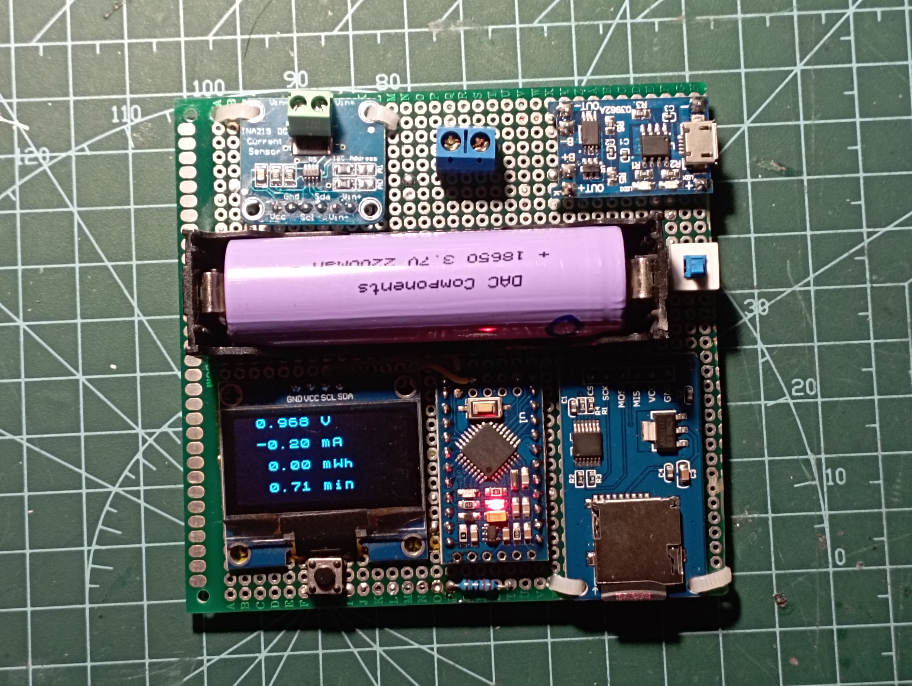

# Arduino Power Logger

**Time is measured in minutes, current in milliamps (mA), and voltage in volts (V). Consider this for calculations.**

**Used libraries:**

- SPI.h
- SD.h
- Wire.h
- U8x8lib.h
- Adafruit_INA219.h

**Hardware requirements:**

- Arduino pro mini
- SPI SD reader
- OLED 128x64 I2c module
- INA219 I2C module
- 1x 10k resistor
- Push Button
- 1x 100k resistor
- 1x 25k resistor
- 1x 18650 LI-ON battery 3.7V
- 1x BMS for 3.7V LI-ON battery 4,2V 1A

**Software requirements:**

- Arduino IDE
